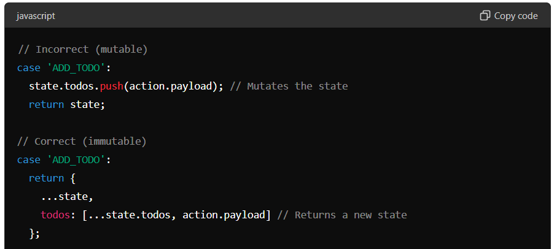

Immutability - Any object is immutable if its original/basic/first version of object remains unchanged even after update. It should create new state and reference for every update.

In Redux immutability is a enforce principle for
  predictable state,
  time travel debugging between previous and  new state 
  Performance manage with shallow comparisions

How to enforce Immutability in Redux 
 1. Using Pure functions in reducers (keep all side effects logic separate and perform before reaching to reducer function)

 2. Avoid direct state mutations
  

3. Using utility library
   Immer (Library allows you to write mutable reducer function, but produces immutable behind the scenes)

4. Using Redux Toolkit for Immutability
Redux Toolkit simplifies writing immutable logic by using the createSlice function and immer under the hood. When using createSlice, you can write "mutating" logic that actually produces a new state immutably.